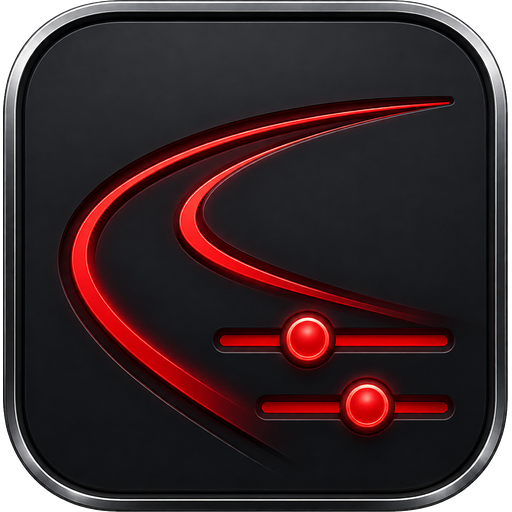
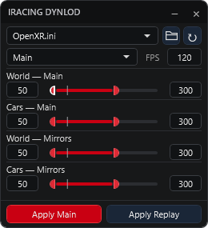

<p align="center"></p>
<h1 align="center">iRacing DynLOD</h1>
<p align="center">A tiny, direct Dynamic LOD editor for iRacing.</p>

<p align="center"><a href="../../releases/latest">Download for Windows</a> · <a href="../../issues">Report an issue</a></p>

<p align="center"></p>

Inspect the values in your iRacing renderer INI, drag or type a change, then apply it to Main or Replay. Built for quick tuning and reapplication after iRSidekick Profiles changes your settings.

## What it does

- World and Cars preset selectors for Main and Replay: Maximum, Medium, Minimum, Decrease, Increase and Off.
- Four Min/Max controls remain available for exact Custom values in the main view and mirrors.
- LOD range **25–500**, with gentle snapping near multiples of 25. Typed values remain unsnapped.
- A literal **FPS target**: the entered integer is written as-is, with no refresh-rate conversion.
- Separate **Apply Main** and **Apply Replay** buttons, using the same displayed values.
- **Refresh** rereads the selected section without writing anything.
- Reads the latest file before each apply and changes only the nine selected keys.
- Creates a timestamped backup beside the INI on every successful apply.
- One portable Windows x64 executable. No installer or separate .NET installation required.

This is a companion to iRSidekick, not a profile manager. There is no telemetry, background watcher, game hook, or automatic tug-of-war with other applications.

## Use

1. Download the Windows ZIP from **Releases**, extract it and open `iRacing-DynLOD.exe`.
2. Select your renderer INI. The app discovers renderer files in your Windows Documents/iRacing folder, prefers OpenXR initially, and remembers your selected path. Use the folder button for another file.
3. World Max cannot be lower than Cars Min. iRacing enforces this for Main and Mirrors and expands World Max when the ranges do not overlap; the editor prevents that rejected combination.
4. Choose **Main** or **Replay** to inspect that section's current values.
5. Drag the small handles or type into the numeric fields. Set FPS.
6. Click **Apply Main** or **Apply Replay**. The displayed values stay ready to apply again.

The refresh icon and changing the file or source section replace displayed edits with values from disk. Apply does not clear your edits. Hover the file selector for the actual full path and the title for the app version.

For predictable persistence, edit with the sim closed; iRacing or another utility can later overwrite its own configuration. This app edits the INI and does not force a running sim to reload it.

## What the numbers mean

**100 is neutral.** Below 100 allows more detail and render cost; above 100 allows less detail and render cost. These are LOD limits, not promises of a particular FPS increase or decrease.

Preset values match iRacing. Maximum is 25–400 (World mirrors 25–500), Medium 50–300, Minimum 75–200, Decrease 100–400 (mirrors 100–500), Increase 25–100, and Off 100/100. Editing any number selects Custom.

Main writes to `[Graphics Options]`; Replay writes to `[Replay Graphics]` in the selected renderer INI. Each action writes all nine displayed values to its target only.

| Control | Min key | Max key |
| --- | --- | --- |
| World — Main | `LODPctDynoMin` | `LODPctDynoMax` |
| Cars — Main | `LODPctMin` | `LODPctMax` |
| World — Mirrors | `LODPctDynoMirrorsMin` | `LODPctDynoMirrorsMax` |
| Cars — Mirrors | `LODPctMirrorsMin` | `LODPctMirrorsMax` |

FPS writes `LODMinFPSTarget`. Values must be whole numbers, each Min must be no greater than its Max, and existing target keys must be present. Unsupported or ambiguous INI structures fail explicitly instead of inventing sections or silently resetting settings.

Backups use `<filename>.dynlod-<timestamp>-<id>.bak`. To recover, close the sim and copy a chosen backup over the original INI. Unrelated contents, comments, encoding and line endings are preserved by the editor as far as practical.

## Build

Requires Windows, PowerShell and the .NET 8 SDK. All source and theme resources are included.

```powershell
.\build.ps1
```

The first build is **1.0.0**. Each later normal build increases the minor version by 0.1: **1.1.0, 1.2.0, ...**. This uses semantic version fields, so 1.9.0 is followed by 1.10.0. A failed publish or test does not advance the saved version. Windows executable metadata, title tooltip, ZIP name and checksum use the same version.

To validate or reproduce the current version without incrementing it:

```powershell
.\build.ps1 -NoVersionBump
```

Output is in `dist/`: the portable executable, versioned ZIP and SHA-256 checksum. The build runs 37 checks against a synthetic renderer INI, covering controls, gentle snapping, literal FPS, separate sections, backups, external edits and encoding preservation. Test fixtures never modify a real iRacing INI.

`Test-IracingNormalization.ps1` is the expandable live-normalisation harness. With the iRacing Test Drive confirmation visible, its default Cycle mode focuses iRacing UI, clicks the measured Test Drive position, waits for the renderer INI to be rewritten, then requests a graceful simulator close. Launch, Close and DryRun modes are also available.

## Credits

Created by **Cooooked**. The compact visual style derives from [ViewLab](https://github.com/Cooooked/xr-viewlab), with its theme resources included under Apache-2.0. This is an independent community utility and is not affiliated with or endorsed by iRacing or iRSidekick.

Licensed under [Apache-2.0](LICENSE).
